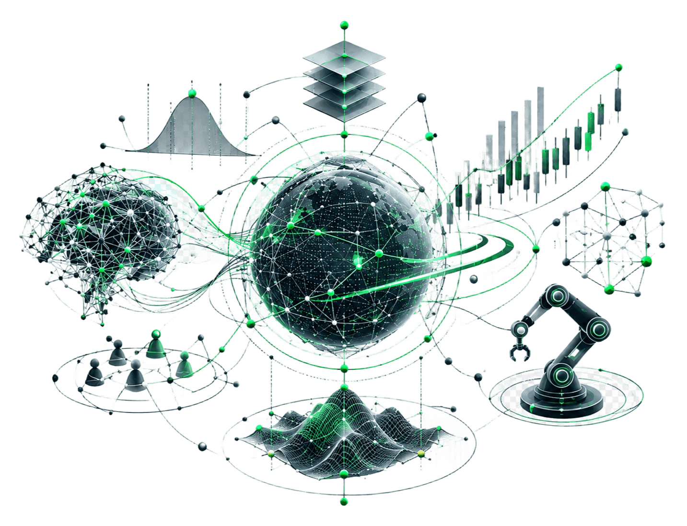

  

  Exploring data, markets, and decision-making through code and research.
   
  <em>Better models. Better decisions.</em>

---

I'm a student and independent builder from Brazil interested in understanding **complex systems, making better decisions, and turning ideas into working systems**.

My interests sit at the intersection of **financial markets, quantitative analysis, artificial intelligence, human behavior, and technology**. Across programming, robotics, research, and data-driven projects, I tend to approach problems from the same direction: understand the system, structure the problem, test assumptions, and build something useful.

I see programming not only as a technical skill, but also as a **way to investigate ideas** — turning questions into models, experiments, and tools that can be tested and improved.

### How I Think

| Dimension           | Approach                                                                      |
| ------------------- | ----------------------------------------------------------------------------- |
| **Research**        | Question assumptions, investigate problems, and work from evidence.           |
| **Data**            | Use structured data and quantitative reasoning to understand complex systems. |
| **Technology**      | Build tools that turn ideas into practical systems.                           |
| **Decision-making** | Explore how information, incentives, and behavior shape outcomes.             |

<table>
  <tr>
    <td width="65%" valign="top">

### Areas of Interest

- Financial Markets & Economics
- Decision Science & Behavioral Economics
- Data Analysis & Quantitative Methods
- Artificial Intelligence & Machine Learning
- Complex Systems & Human Behavior
- Research & Experimentation
- Robotics & Technology

    </td>

    <td width="35%" align="center" valign="middle">

    </td>
  </tr>
</table>

### Technical Stack

  
  
  
  
  

### Background

My background combines **programming, robotics, academic competitions, research, and independent technical projects**.

I co-founded and helped lead **New Gears**, a research-oriented robotics team, working across programming, strategy, and innovation. My academic interests have also led me to explore economics, mathematics, science, and technology through competitive problem-solving and independent research.

The common thread across these experiences is a long-term interest in **how systems work — and how they can be understood, modeled, and improved**.

### Connect

[GitHub](https://github.com/MateusGambetta) · [LinkedIn](https://www.linkedin.com/in/mateus-gambetta-de-souza-0b40092bb/)

  

